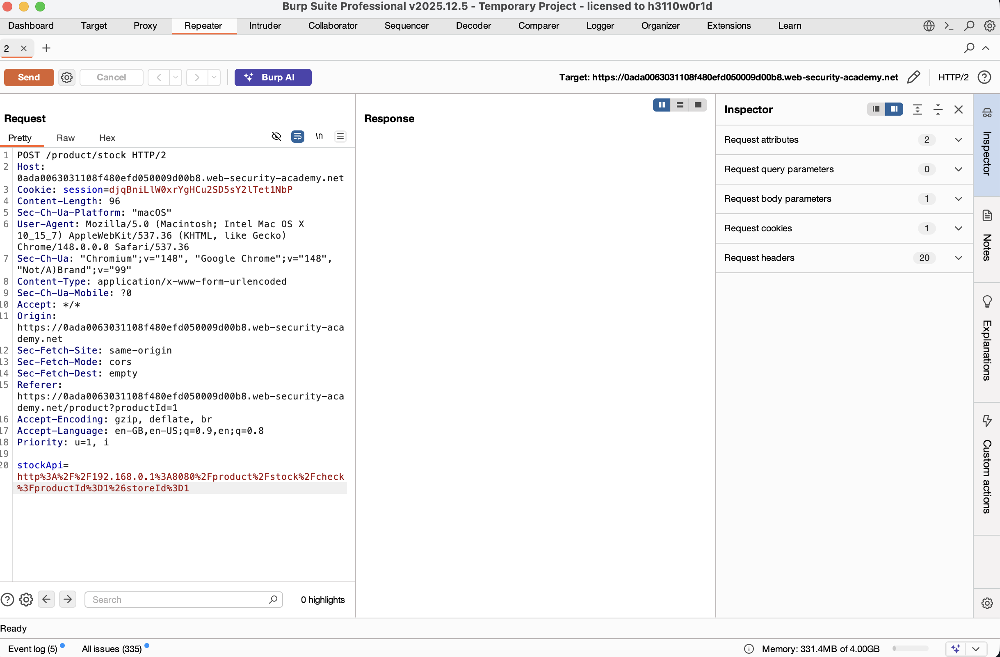
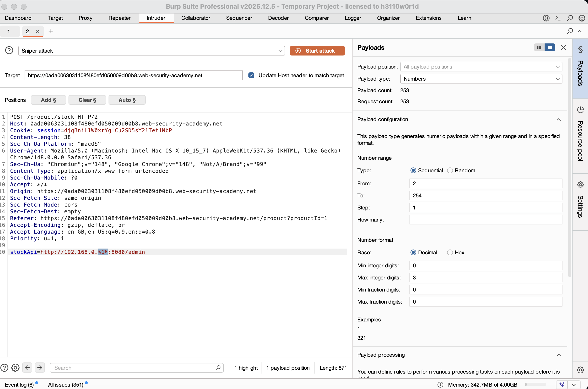
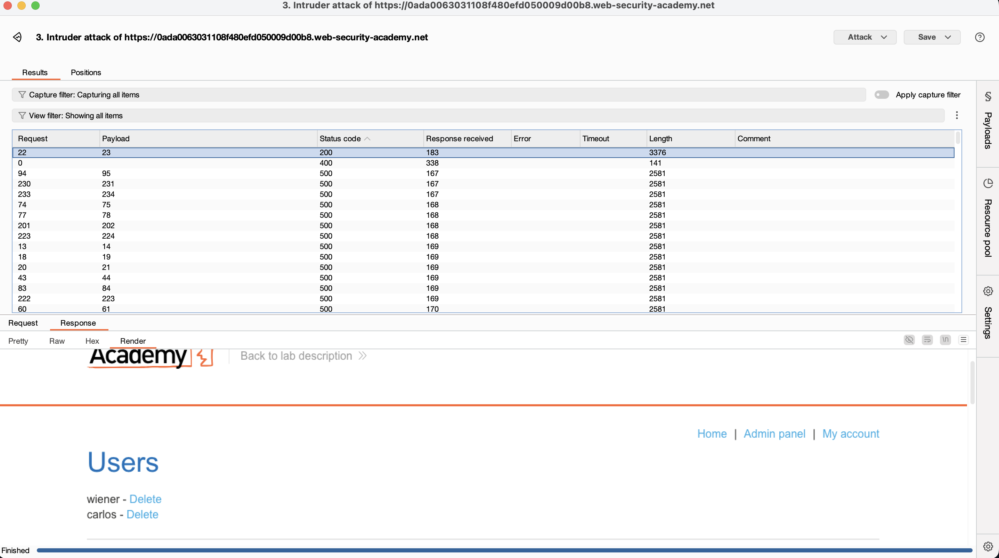
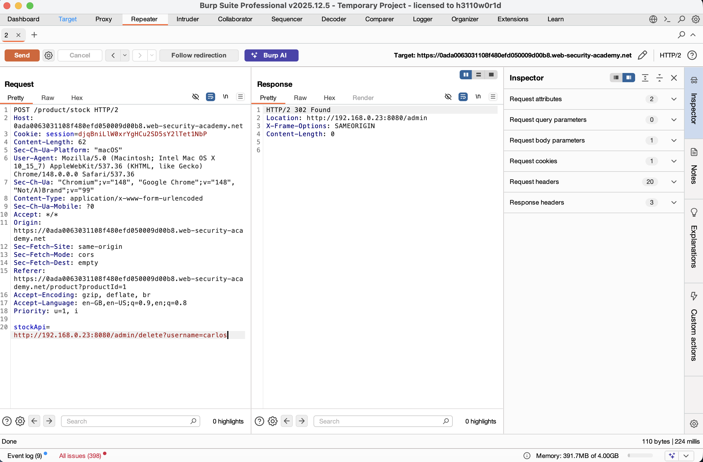
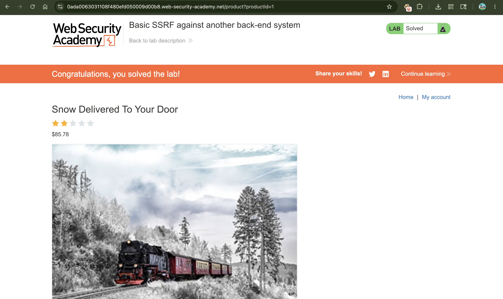

# Exploiting Basic SSRF against Another Back-End System

## 📌 Summary

The application is vulnerable to **Server-Side Request Forgery (SSRF)** via its stock check functionality. Unlike targeting a local server loopback, this vulnerability allows an attacker to force the hosting server to scan and interact with other live machines inside its private internal network segment (`192.168.0.X`). By scanning the range, an attacker can find an isolated internal administrative backend panel and execute privileged operations.

---

## 🧾 Description

This web application contains an SSRF flaw where the server processes user-controlled backend endpoints to fetch stock data. Because the application server is positioned inside an internal infrastructure network, it can communicate with other private backend servers that are completely unreachable from the public internet.

By utilizing an automated network sweep (brute-forcing the local IP subnet range), we can pinpoint the precise internal IP address hosting a hidden admin panel on port 8080. Once identified, the SSRF vulnerability allows us to craft a malicious request proxying through the main server to perform administrative tasks, such as deleting internal user profiles.

---

## 🔁 Steps to Reproduce

1. Go to any product page, click on the **"Check stock"** button, and intercept the request using **Burp Suite**.

2. Send this original stock check request to **Burp Intruder**. Notice the default internal API address inside the payload parameters.

```http
POST /product/stock HTTP/2
...
stockApi=http%3A%2F%2F192.168.0.1%3A8080%2Fproduct%2Fstock%2Fcheck%3FproductId%3D1%26storeId%3D1
```

3. Clear any automatic payload markings and modify the target URL to map the entire internal network block. Set the position payload parameter on the final octet of the IP address:

```text
stockApi=http://192.168.0.§1§:8080/admin
```

4. Navigate to the **Payloads** side tab, change the payload type selection to **Numbers**, and set the configuration parameters to scan sequentially across the network:

* **From:** 2
* **To:** 254
* **Step:** 1

5. Launch the attack by clicking **Start attack**. Monitor the response results; a valid internal server hosting the portal will respond with an HTTP status code **200 OK** instead of standard 500 error timeouts. In this case, the active host discovered is at `192.168.0.23`.

6. Take the successful endpoint vector over to **Burp Repeater** and rewrite the request parameter path to target the discovered internal admin console's delete query parameters for user `carlos`:

```text
stockApi=http://192.168.0.23:8080/admin/delete?username=carlos
```

7. Click **Send** to process the payload. The main web server relays the delete instruction to the private back-end host, removing the target account and resolving the lab.

---

## 📸 Proof of Concept (PoC)

### Intercepting the Initial Backend Stock Status Endpoint Request



### Configuring Burp Intruder to Scan the Internal IP Range



### Identifying the Active Internal Host (`192.168.0.23`)



### Sending the User Deletion Request Through Burp Repeater



### Lab Solved Successfully



---

## 💥 Impact

* **Internal Infrastructure Reconnaissance** Attackers can map out host IP addresses, active ports, and hidden internal network typologies directly using the trusted server as a perimeter jump-box.
* **Bypassing Perimeter Security Defenses** Access controls, firewall filters, and network segmentations designed to isolate staging or internal admin systems from the outside internet are entirely bypassed.
* **Privileged Actions on Private Microservices** Unauthorized administrative requests can be triggered on unauthenticated back-end servers, leading to database modifications or permanent deletion of user profiles.

---

## 🛠️ Remediation

To secure the application against internal infrastructure SSRF:

* **Enforce Strict Destination Allow-lists** Restrict the stock application to connect exclusively to specific pre-approved external domain endpoints. Ensure the system drops connections containing private network IP spaces (`10.0.0.0/8`, `172.16.0.0/12`, `192.168.0.0/16`).
* **Implement Strict Input Parsing Validation** Avoid raw URL strings as parameter definitions. Instead, pass clean localized variables (e.g., `storeId=1`) and build out destinations safely using internal hard-coded routing maps on the server side.
* **Authenticate Internal Back-end Services** Never rely on network-level location isolation alone for security. Implement strict token authorization, mutual TLS, or credentials on internal dashboards (like the `/admin` portal) so they remain secure even if an SSRF occurs.