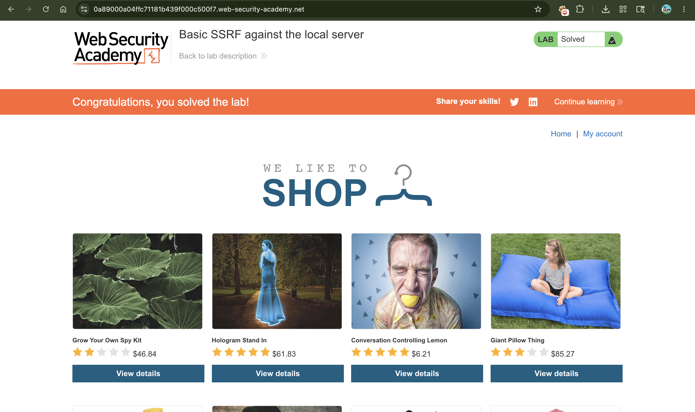

# SSRF with Filter Bypass via Open Redirection Vulnerability

## 📌 Summary

The application is vulnerable to **Server-Side Request Forgery (SSRF)** because its stock verification system can be manipulated. While the stock feature contains a strict input validation filter that blocks external URLs or internal local loops directly, an attacker can bypass this restriction by chaining it with an **Open Redirection** vulnerability found in another part of the application.

---

## 🧾 Description

This web application uses a strict input filter on the `stockApi` parameter to stop users from entering arbitrary server destinations. It only accepts localized relative API endpoints (like `/product/stock/check`).

However, the application also contains an open redirection flaw on its item switching endpoint (`/product/nextProduct`). This script takes a destination address via the `path` parameter and sends an HTTP `302 Found` response to forward the client browser without validating where it points.

Because the backend server's stock check script automatically follows HTTP redirects, we can pass a local reference pointing to our open redirect page as the input. The server considers the initial path safe, requests it locally, and gets redirected straight to the internal admin system on port 8080—bypassing the security filter completely.

---

## 🔁 Steps to Reproduce

1. Click on a product on the website, select **"Check stock"**, and intercept the transaction using **Burp Suite**. Send the request to **Burp Repeater**. Notice that the `stockApi` parameter only accepts local relative paths:
```text
stockApi=/product/stock/check?productId=1&storeId=1

```


2. Browse the application to find a redirect feature. When clicking "Next product", observe that the application triggers an open redirection using a query parameter setup:
```text
GET /product/nextProduct?currentProductId=3&path=https://google.com

```


3. Notice that the server issues a `302 Found` response back, proving it will forward requests to any external or arbitrary domain passed into the `path` parameter.
4. Chain these two elements together. Go back to your stock request in Burp Repeater and modify the `stockApi` value. Force it to request the local redirection script while pointing the `path` logic toward the internal admin node:
```text
stockApi=/product/nextProduct?path=http://192.168.0.12:8080/admin/delete?username=carlos

```


5. Click **Send**. The stock check mechanism reads the local path, trusts it, and initializes the HTTP request. Once it hits the script, it receives a redirect instruction and follows it directly to the hidden back-end subnet interface to delete the user `carlos`.

---

## 📸 Proof of Concept (PoC)

1. Examining the default stock check configuration parameters in Burp Repeater


2. Testing and confirming the open redirection issue on the next product path variable


3. Intercepting the open redirection structure within the active proxy history logs


4. Submitting the chained exploit payload inside Burp Repeater to achieve the bypass


5. Lab solved successfully


---

## 💥 Impact

* **Bypassing Restrictive Input Controls** Strict validation filters that look for restricted words or specific URL pattern architectures can be completely defeated if the application hosts a secondary open redirect feature.
* **Access to Private Network Nodes** Attackers can interact with hidden internal microservices or micro-management software running within the private cloud loop that are otherwise completely sealed from the outside.
* **Privileged Execution and Multi-Vulnerability Chaining** Combining minor vulnerabilities (like an open redirect) with backend design choices allows attackers to execute critical administrative commands, such as removing users.

---

## 🛠️ Remediation

To secure the application against redirection-based SSRF:

* **Strictly Restrict Automatic Redirection** Configure the backend HTTP client engine responsible for performing stock checks to never follow automatic `302` or `301` redirection paths initiated by target hosts.
* **Implement Strict Allow-lists on Redirect Paths** Ensure that destination parameters inside utility files (like `/product/nextProduct`) only allow switching between predefined relative product paths, and explicitly block schemes containing `http://` or `https://`.
* **Adopt Tokenization for App Navigation** Avoid letting user queries directly define navigation links. Use solid application index identifiers on the backend instead of passing dynamic URL paths through query fields.